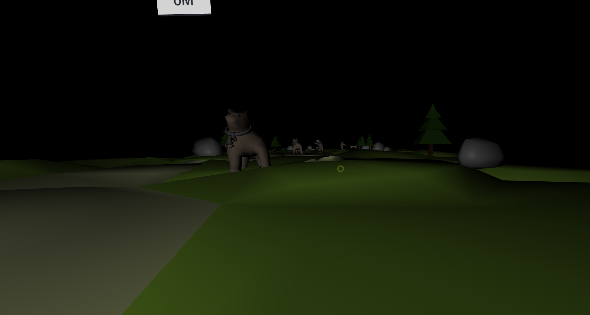
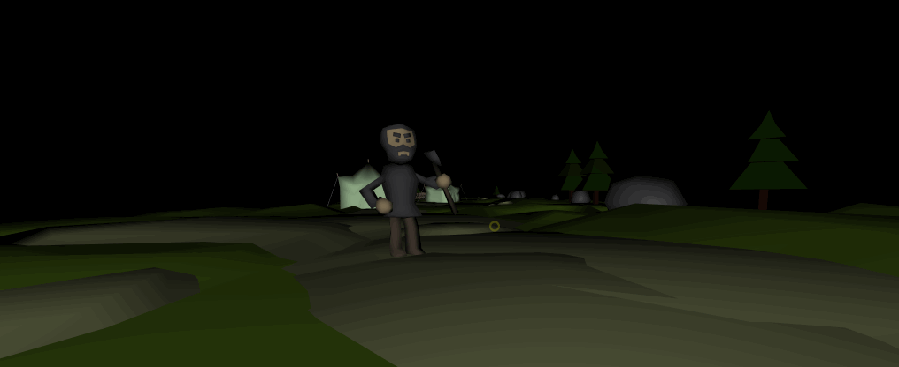
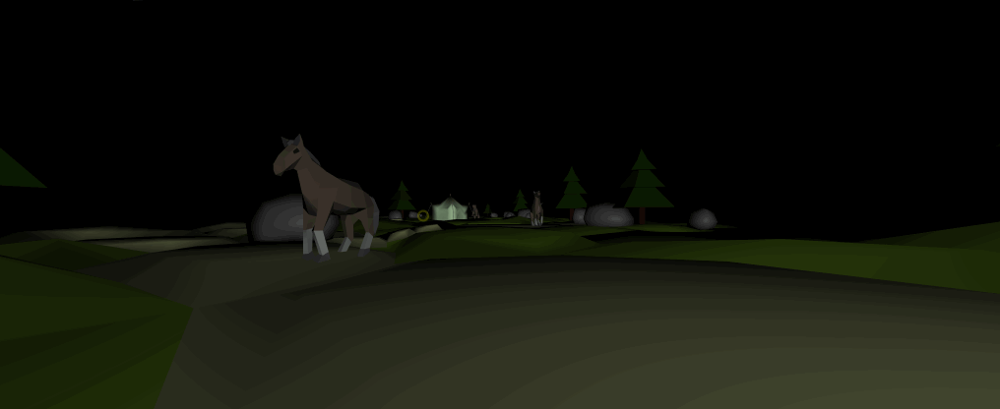

# Fantasy Run

Endless runner. In a fantasy world.
Built with [A-Frame](https://aframe.io) for [Mozilla's WebVR Medieval Fantasy Chellange](https://challenges.mozilla.community/webvr-challenge/).



## Setup
```sh
npm install
npm run start
```

## How?
  - Look left or right to dodge obstacles. Really, is this simple.
  - Your best distance is stored in `localstorage`.

## Assets
I used brilliant `The Beast is out!` model set from [here](https://sketchfab.com/models/8a142fb16e3147aaa4b07cce72dead34). I rigged them and added animations in Blender.



Sounds are from:
 - https://www.freesoundeffects.com/searches/yell/1/20/
 - https://opengameart.org/content/heroes-theme
